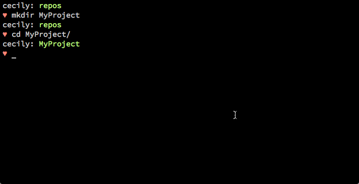
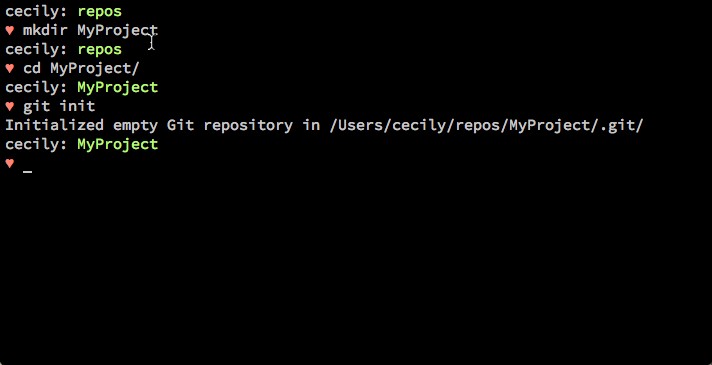
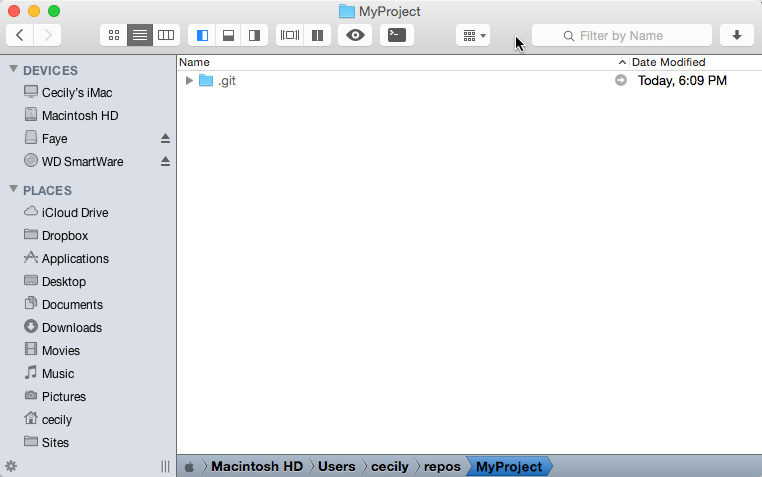
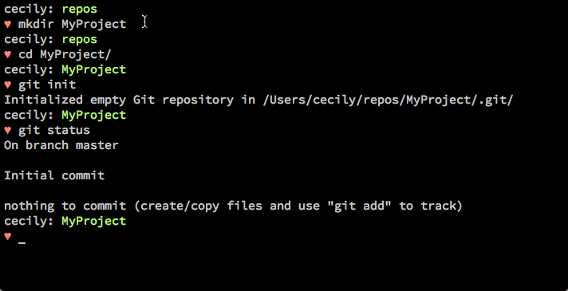
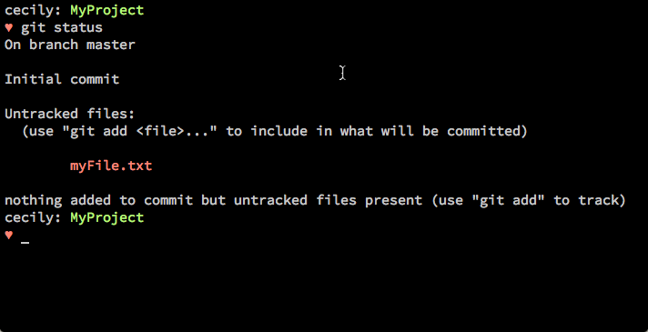

# Creating Your First Git Repository
Now that you've set up a GitHub account and installed Git, it's time to set up a space where your project will live. This space -- called a **repository** -- is where you'll store all of your project's files, assets, and all the versions of the files that Git saves. 

You can turn any folder into a Git repository. The catch is that you have to be inside the folder you want to turn into a repository. 

I like to keep my repositories in a local folder called `repos`. From the command line, I `cd` into the `repos` directory by typing `cd repos`. 

I'm going to create a new folder in this directory by typing `mkdir MyProject` at the command prompt. Then I'll type `cd MyProject` to switch into that directory. 

Now what we want to do is initialize this directory as a git repository. To initialize a folder as a repository, type `git init` from the command line and hit Enter/Return on your keyboard. 

I'm on a Mac, and I have hidden folders turned on in the Finder, so if I go to the repos/MyProject directory, I'll see a .git folder. The presence of this folder tells me that Git was initialized successfully. 

Don't worry if you can't see these files. You should actually leave them alone, because Git needs them to do its job. I just wanted to show you some proof that Git had been initialized in this directory.

## Check Git Status
Sometimes as you're working on your project, you can lose track of what files have been updated and which files should be added to the repository. This is where `git status` comes in handy.  I haven't created any files in this directory, but if I type `git status` from the command line, Git will respond by telling me the current branch I'm on (more on branches later), and whether there are any files that should be added to the repository. 

## Adding Files
Now that our repository is up and running, the next thing we need to do is add some files for Git to track.  From the command line, type: 

    touch myFile.txt

This tells your system to create a new file called myFile.txt.  If you go back to the folder using the Finder or your Start menu, you'll see an empty myFile.txt file is now inside.  But does Git know the file is there?  Let's find out. 

Type `git status` at the command line. What do you see? 

You can see that you're still on the master branch of your repository.  You'll also notice that myFile.txt is an **untracked** file. Git knows the file exists, but it won't actually add the file to  your repository until you tell it to. 

To add the file to your repository, type: 

    git add myFile.txt

This tells Git to track the file and any future changes.  Next, you'll want to **commit** the file, or take a snapshot of the project at its current state. To do this, type:

    git commit -m "Add myFile.txt"

Let's break down this command.  The `-m` flag tells Git to add a message to the snapshot that summarizes what changes you made to your project. 

### Commit Message Best Practices
Your commit messages should be informative but brief -- no more than 50 characters long -- and should be wrapped in quotation marks. Do not put a period at the end of your message. 

Some people believe commit messages should only be written in the imperative tense, as if you're commanding someone to do something, e.g., "Add my file", "correct code block".  If you want to read more about writing good commit messages,  the Erlang project has an [excellent summary](https://github.com/erlang/otp/wiki/writing-good-commit-messages) on their Github wiki.  Jonathan Yeung wrote a [very useful article](https://medium.com/@JonoYeong/what-i-learnt-from-writing-better-commit-messages-c5b500731dbb) about what he learned from writing better commit messages.  
Some people believe commit messages should only be written in the imperative tense, as if you're commanding someone to do something, e.g., "Add my file", "Correct code block".  If you want to read more about writing good commit messages,  the Erlang project has an [excellent summary](https://github.com/erlang/otp/wiki/writing-good-commit-messages) on their Github wiki.  Jonathan Yeung wrote a [very useful article](https://medium.com/@JonoYeong/what-i-learnt-from-writing-better-commit-messages-c5b500731dbb) about what he learned from writing better commit messages.  

In short, the clearer your commit message, the more you'll learn when you look back at your project but can't remember what changes you made.
