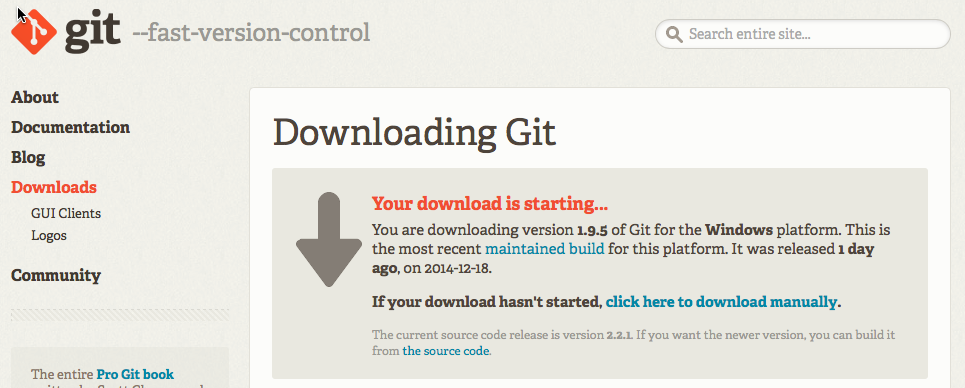

#Set Up Git and GitHub

## What is GitHub?
If you're going to use a distributed version control system, you'll need someplace to store your files. That's where [GitHub](http://www.GitHub.com) comes in. 

GitHub is a web-based hosting platform for Git repositories. GitHub is built on top of Git, and it puts your version controlled projects on the web where you can manage them from any device with an internet connection. GitHub also has a few social features built-in, like following a projects, comments and discussions about projects, and the ability to allow others to easily share and contribute to your work (if you want them to). 

## Setting up a GitHub Account
Go ahead and sign up for a GitHub account. Signing up should be just as easy as signing up for any other social networking service.

One thing to remember is *the email address you use to sign up for GitHub will be tied to your personal repositories*, and you can only tie one email address to an account. Make sure you write down which email address you've associated with this account, because you'll need it when you set up Git. 

Once you're signed in, GitHub will take you an entry page that shows you a few basic actions you can do on the service, and a few links to some key documentation. If you've never used GitHub, you won't have any repositories or activity, so we'll come back to this section a little later in the tutorial. 

Now that you've set up your GitHub account, it's time to install Git on your computer. 

## Install Git for Windows

1. [Download the Git for Windows installer](http://git-scm.com/download/win) from the official Git website. 
2. Click the executable to run the installer. Once the installer has started, you should see a **Git Setup Wizard** screen. 
3. Press **next** to move to the next page of the wizard. This will display the license agreement.  Click **next** to accept the license agreement and continue.
4. If you want to accept all of the defaults (and you do), click **next** on each page of the Setup Wizard. Click **finish** to complete the installation. 
5. Open the Git Bash window by Choosing **Start > All Programs > Git > Git Bash**.  
6. Configure your global user name. Type the following into the terminal: `git config --global user.name "FirstName LastName" ` (replace "FirstName LastName" with your name)
7. Configure your global email address by typing `yourEmail@example.com` into the terminal. Use the same email address for all your commits.

## Install Git for Mac OS X

1. Make sure you have root access `(sudo)` on the system where you'll install Git. 
2. [Download the Git installer](http://git-scm.com/download/mac) from the official Git website. 
3. Double-click the .dmg file to expand the installer(it should be in your Downloads folder).
4. Double-click the .pkg file to install Git.
5. Follow the installer prompts. 
6. Open the Terminal.
7. Verify your installation by typing `which git` at the command line. 
8. Configure your global user name. Type the following into the terminal: `git config --global user.name "FirstName LastName" ` (replace "FirstName LastName" with your name)
9. Configure your global email address by typing `yourEmail@example.com` into the terminal. Use the same email address for all your commits. 

## Install Git for Linux

*Should we even cover Linux? I feel like anyone who's using Linux probably already knows how to use Git?*
